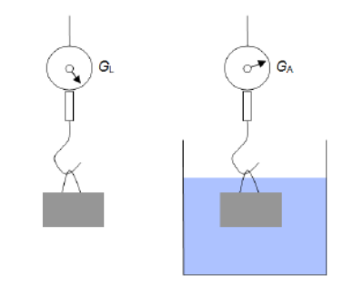

```{r data generation, echo = FALSE, results = "hide"}
# Prepare sketch
include_supplement("B1_figure.png", dir = "figures", recursive = TRUE)

# Weight of the alloy in air
GL <- round(runif(1, 25, 50), 3) # N rounded to three decimal places

# Volume fraction of zinc between 5% and 45%
wZn <- runif(1, 5, 45) / 100

# Density of the fluid
rhoF <- sample(seq(from = 700, to = 1300, by = 10), 1) # kg/m³

# Volume fraction of copper
wCu <- 1.0 - wZn

# Density of zinc
rhoZn <- 7190 # kg/m³

# Density of copper
rhoCu <- 8920 # kg/m³

# Density of water at 20 degrees Celsius
rhoW <- 998.21 # kg/m³

# Gravitational constant in m/s²
g <- 9.81

# Mass and volume
m <- GL / g

mZn <- m * wZn
mCu <- m * wCu

VZn <- mZn / rhoZn
VCu <- mCu / rhoCu

V <- VZn + VCu

# Weight under buoyancy
GA <- GL - V * rhoF * g

# Density of the brass alloy
rhoL <- m / V
```

```{r answers/solutions, echo = FALSE, results = "hide"}
answers <- solutions <- explanations <- tolerances <- rep(list(""), 6)
types <- rep(list("num"), 6)

# Assigning values for question 1
answers[[1]] <- ""
solutions[[1]] <- explanations[[1]] <- mCu
tolerances[[1]] <- 0.01

# Assigning values for question 2
answers[[2]] <- ""
solutions[[2]] <- explanations[[2]] <- mZn
tolerances[[2]] <- 0.01

# Assigning values for question 3
answers[[3]] <- ""
solutions[[3]] <- explanations[[3]] <- wCu
tolerances[[3]] <- 0.002

# Assigning values for question 4
answers[[4]] <- ""
solutions[[4]] <- explanations[[4]] <- wZn
tolerances[[4]] <- 0.002

# Assigning values for question 5
answers[[5]] <- ""
solutions[[5]] <- explanations[[5]] <- rhoL
tolerances[[5]] <- 10

# Assigning values for question 6
answers[[6]] <- c("Weight would be higher", "Weight would be lower")
type[[6]] <- "schoice"
solutions[[6]] <- explanations[[6]] <- c((rhoF > rhoW), (rhoF < rhoW))
tolerances[[6]] <- 0
```

Question
========

A brass object has a weight of $G_L$ in air and, under buoyancy in a fluid with a density of $\rho_F$, a weight of $G_A$. The alloy components, copper and zinc, each have densities of $\rho_{Cu}$ and $\rho_{Zn}$.

- $G_L$ = `r format(round(GL, 3), nsmall = 3)` N  
- $G_A$ = `r format(round(GA, 3), nsmall = 3)` N  
- $\rho_{Zn}$ = `r rhoZn` kg/m³  
- $\rho_{Cu}$ = `r rhoCu` kg/m³  
- $\rho_F$ = `r rhoF` kg/m³  
- $\rho_W$ = `r rhoW` kg/m³  

```{r include-image, echo=FALSE, out.width='40%', fig.cap = " "}

```

| Question                                                                              | Answer      |
|---------------------------------------------------------------------------------------|-------------|
| What is the mass of copper in the alloy in $kg$?                                    b | ##ANSWER1## |
| What is the mass of zinc in the alloy in $kg$?                                        | ##ANSWER2## |
| What is the mass fraction of copper in the alloy?                                     | ##ANSWER3## |
| What is the mass fraction of zinc in the alloy?                                       | ##ANSWER4## |
| What is the density of the brass alloy in $kg/m³$?                                    | ##ANSWER5## |
| Would the weight of the brass under buoyancy in water at $20°C$ be higher or lower?   | ##ANSWER6## |


```{r questionlist, echo = FALSE, results = "asis"}
answerlist(paste(unlist(answers), ".", sep=""))
```

Solution 
========

## Partial Masses {-}

The weight of the object in air is:

- $G_L = \rho_{Cu} \cdot g \cdot (V_{Zn} + V_{Cu})$

The buoyant force corresponds to:

- $G_L - G_A = \rho_F \cdot g \cdot (V_{Zn} + V_{Cu})$

The solution to the system of equations gives the volumes:

- $V_{Zn} = \frac{G_L - G_A - \frac{\rho_W}{\rho_{Cu}} \cdot G_L}{\rho_W \cdot g - \frac{\rho_W \cdot \rho_{Zn} \cdot g}{\rho_{Cu}}} =$ `r round(VZn * 10^6, 1)` cm³

- $V_{Cu} = \frac{G_L - \rho_{Zn} \cdot g \cdot V_{Zn}}{\rho_{Cu} \cdot g} =$ `r round(VCu * 10^6, 1)` cm³


```{r solutionlist, echo = FALSE, results = "asis"}
# Add dollar signs for negative values in explanations for questions 1-5
if(any(explanations[c(1,2,3,4,5)] < 0)) {
  explanations[c(1,2,3,4,5)] <- lapply(solutions[c(1,2,3,4,5)], function(x) paste("$", x, "$", sep = ""))
}

# Convert solutions for question 6 to "True" or "False"
explanations[6] <- lapply(solutions[6], function(x) ifelse(x, "True", "False"))
solutions[6] <- lapply(solutions[6], mchoice2string)

answerlist(paste(unlist(explanations), ".", sep = ""))
```

META-INFORMATION
================
exname: B
extitle: Hydrostatik
extype: cloze
exsolution: `r paste(solutions, collapse = "|")`
exclozetype: `r paste(types, collapse = "|")`
extol: `r paste(tolerances, collapse = "|")`
exshuffle: TRUE
exversion: 2024WS